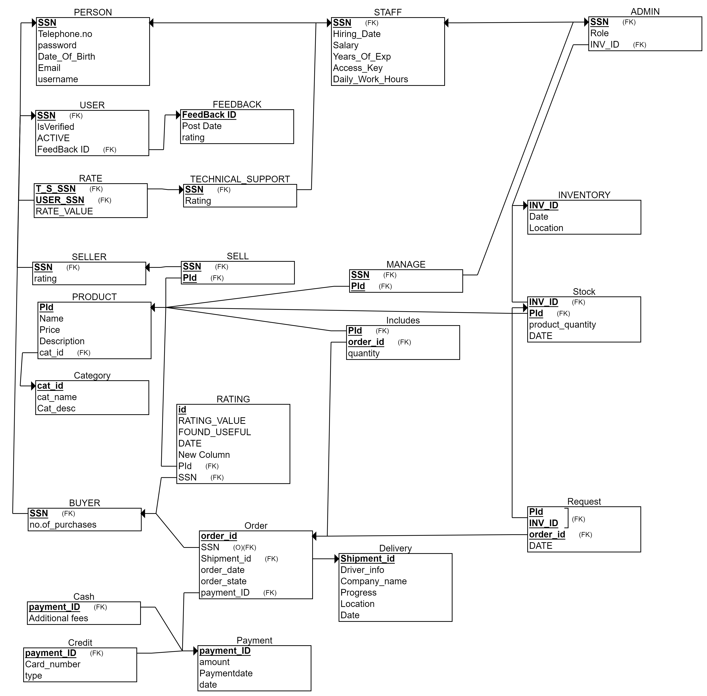

# OnlineStoreDataBase
* This repository encompasses the database design and implementation for an online store, focusing on SQL implementation. The project provides both the conceptual design and the SQL scripts necessary to create and populate the database.

## EER Diagram 

## Relational Diagram

